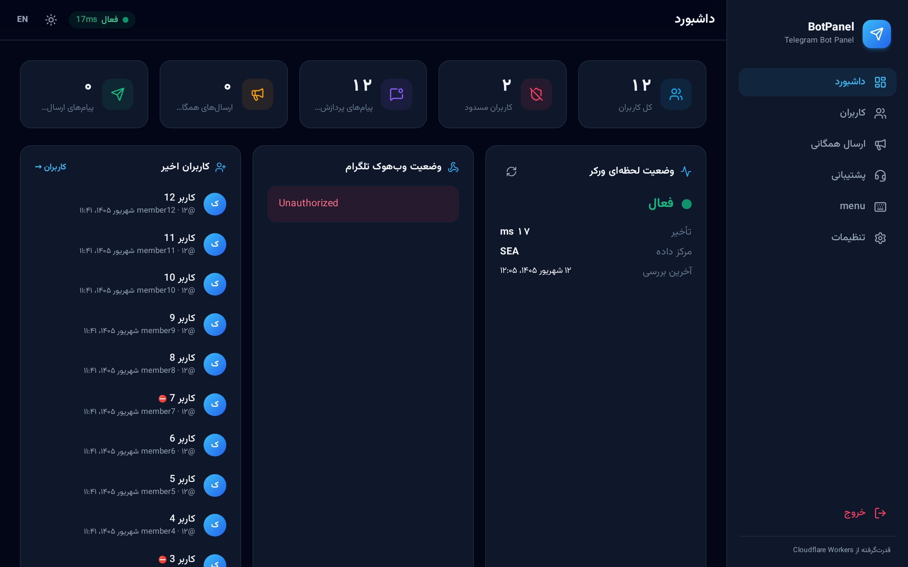
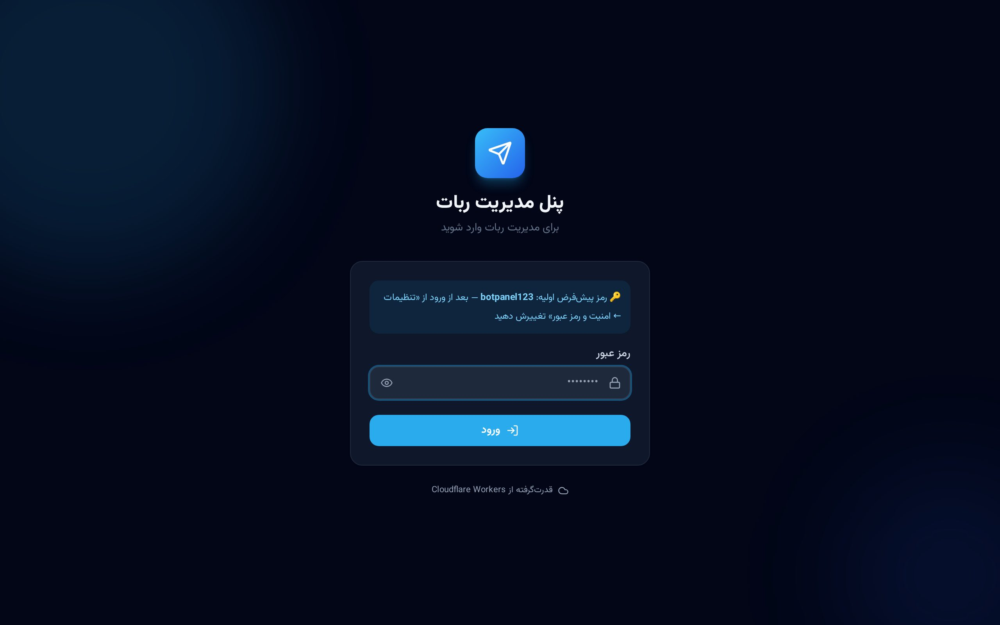
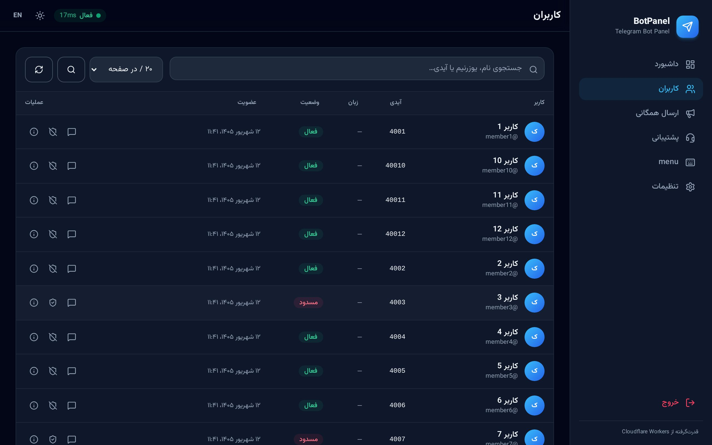
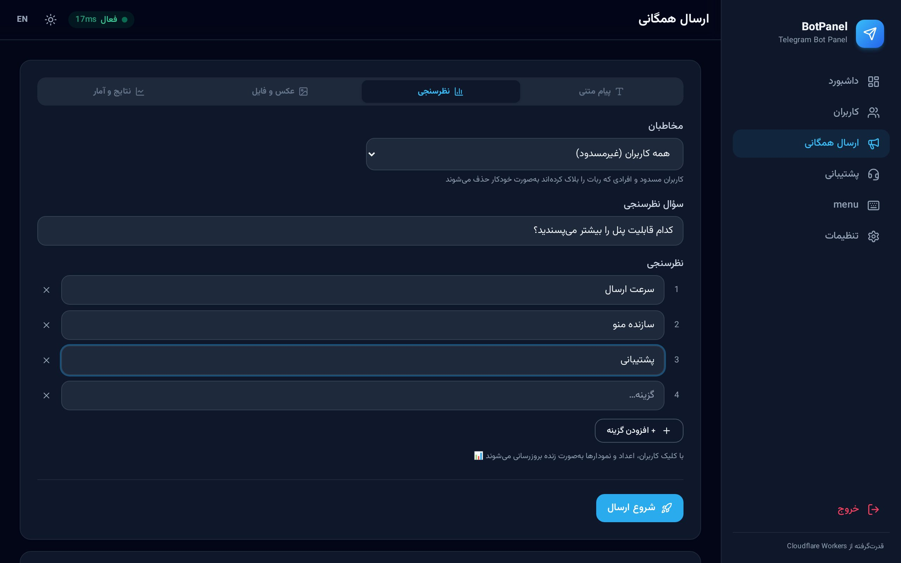
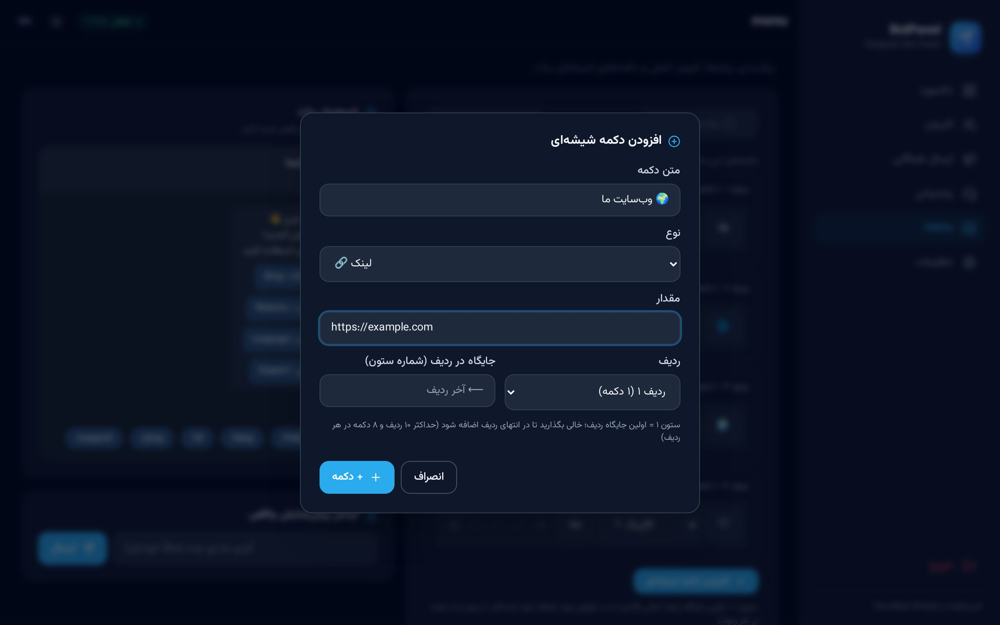
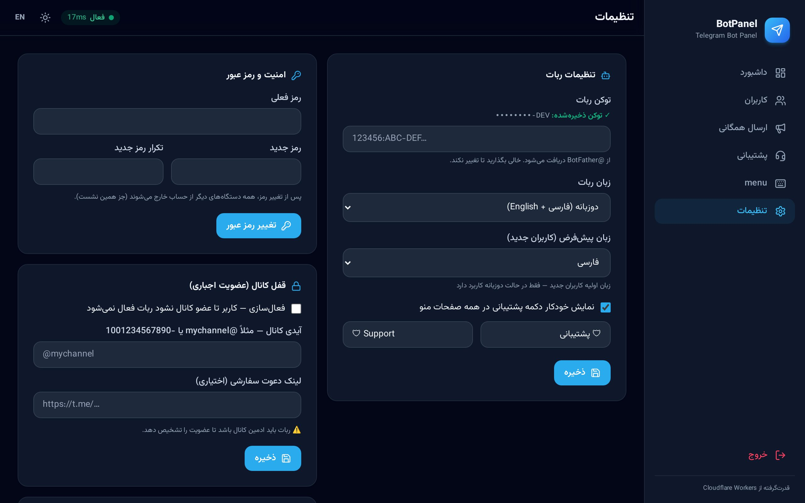
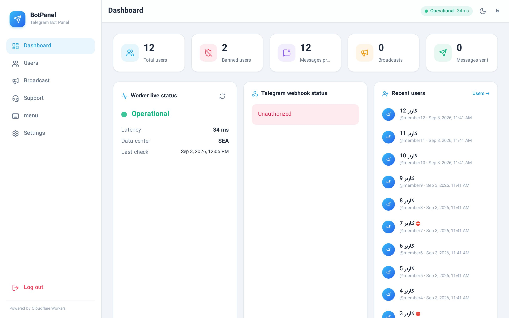
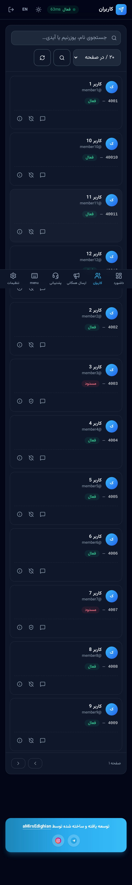

<div align="center">

# 🤖 BotPanel

**پنل مدیریت ربات تلگرام | Telegram Bot Admin Panel**

دو زبانه (فارسی/انگلیسی) · آماده پروداکشن · کاملاً Serverless
Bilingual (FA/EN) · Production-ready · Fully serverless


**فارسی** · [English ↓](#-english)



</div>

---

## 📸 گالری | Gallery

| | |
|---|---|
|  |  |
| **ورود امن · Secure login** | **داشبورد و وضعیت زنده · Dashboard** |
|  |  |
| **مدیریت کاربران · Users** | **سازنده نظرسنجی تعاملی · Poll builder** |
|  |  |
| **ویرایشگر دکمه با ردیف/ستون + شبیه‌ساز · Button editor + simulator** | **زبان ربات و تنظیمات · Settings** |
|  |  |
| **حالت روشن + EN · Light + English** | **موبایل: کارت‌های کاربر + فوتر رنگی · Mobile: user cards + footer** |

---

<div dir="rtl" lang="fa">

## 📖 معرفی

پنل مدیریت وب **دو زبانه (فارسی/انگلیسی)** برای ربات تلگرام که **تماماً** روی زیرساخت Cloudflare اجرا می‌شود — بدون سرور، بدون دیتابیس خارجی و بدون هزینه در پلن رایگان برای شروع:

- **بک‌اند:** Cloudflare Workers (سینتکس ES Modules + فریمورک Hono)
- **پایگاه‌داده:** Cloudflare KV (نشست‌ها، تنظیمات، کاربران، ارسال همگانی)
- **فرانت‌اند:** اپ تک‌صفحه‌ای (SPA) با Tailwind CSS + آیکون‌های Lucide + فونت وزیرمتن
- **تلگرام:** وب‌هوک امن با هدر مخفی `secret_token` و پاسخ فوری ۲۰۰

## 🤖 درباره ربات (توضیح کامل)

این پروژه یک **ربات تلگرام آماده + پنل مدیریت کامل** است که با هم در یک Worker اجرا می‌شوند. ربات همین حالا کار می‌کند و همه رفتارش از داخل پنل قابل کنترل است — بدون دست زدن به کد.

### دستورات پیش‌فرض ربات

| دستور | کارکرد |
|---|---|
| `/start` | پیام خوش‌آمد (با متغیرهای `{name}`، `{username}`، `{id}`) + دکمه‌های شیشه‌ای + فعال‌سازی کیبورد اصلی |
| `/help` | نمایش متن راهنما (قابل ویرایش از پنل، جدا برای فا/EN) |
| `/lang` | تغییر زبان کاربر با دکمه شیشه‌ای — زبان هر کاربر جداگانه در KV ذخیره می‌شود *(فقط حالت دوزبانه)* |
| `/id` | نمایش آیدی عددی کاربر (برای ارسال پیام به «کاربران خاص» از پنل) |
| `/ping` | بررسی فعال بودن ربات |
| `/support` | شروع گفتگو با پشتیبانی — پیام‌های بعدی به صندوق پنل می‌رسد |
| `/end` | پایان گفتگو با پشتیبانی |

### جریان کار ربات

1. **ثبت خودکار کاربران:** اولین پیام هر کاربر → ذخیره نام، یوزرنیم، زمان عضویت، زبان و آخرین فعالیت در KV → نمایش فوری در پنل.
2. **دو زبانه یا تک‌زبانه:** در حالت دوزبانه هر کاربر با `/lang` زبانش را انتخاب می‌کند؛ در حالت تک‌زبانه (فقط فا یا فقط EN) زبان ثابت است و `/lang` غیرفعال می‌شود — از «تنظیمات ← زبان ربات». **دکمه پشتیبانی هم خودکار به همه صفحات منو اضافه می‌شود** (متن سفارشی فا/EN).
3. **منوی کامل قابل ویرایش:** متن خوش‌آمد/راهنما و دکمه‌های شیشه‌ای (لینک، کال‌بک، زیرمنو، پاپ‌آپ) همگی از پنل ویرایش می‌شوند و **بدون دیپلوی مجدد** اعمال می‌شوند؛ جای هر دکمه با انتخاب **ردیف و ستون** مشخص و با فلش‌ها جابه‌جا می‌شود.
4. **مسدودسازی:** کاربر مسدودشده به‌صورت کاملاً بی‌صدا نادیده گرفته می‌شود (نه جواب می‌گیرد و نه در ارسال همگانی حساب می‌شود) و دلیل مسدودی ثبت می‌شود.
5. **ارسال همگانی هوشمند:** با رعایت محدودیت نرخ تلگرام (~۲۵ پیام/ثانیه قابل تنظیم)، به‌صورت دسته‌ای ارسال می‌شود؛ پیشرفت زنده در پنل، امکان توقف/ادامه، و تشخیص خودکار افرادی که ربات را بلاک کرده‌اند (خطای 403 → علامت‌گذاری و حذف از ارسال‌های بعدی).
6. **پیام مستقیم:** ارسال پیام شخصی به هر کاربر از داخل پنل با فرمت HTML یا Markdown.
7. **نظرسنجی تعاملی:** با دکمه‌های شیشه‌ای به همه/کاربران خاص/کانال ارسال می‌شود؛ با هر کلیک، شمارنده و نمودار میله‌ای همان پیام زنده بروزرسانی می‌شود (تغییر رأی هم ممکن است) و نتایج در «ارسال پیام ← نتایج» دیده می‌شود.
8. **عکس با لایک/دیسلایک:** عکس با کپشن و دکمه‌های 👍/👎؛ هر کاربر یک رأی قابل‌تغییر دارد و شمارش‌ها روی دکمه‌ها زنده بروزرسانی می‌شوند.
9. **پشتیبانی دوطرفه:** کاربر `/support` می‌فرستد → پیام‌هایش در صندوق پنل با badge خوانده‌نشده ظاهر می‌شود → پاسخ ادمین مستقیم در تلگرامش تحویل می‌شود.
10. **قفل کانال:** اگر فعال باشد، کاربر غیرعضو پیام قفل + دکمه عضویت + «عضو شدم» می‌گیرد؛ بعد از عضویت و تایید، ربات برایش فعال می‌شود. مدیریت ربات فقط از پنل وب انجام می‌شود (سیستم «ادمین تلگرامی» حذف شده است).

### امنیت ربات و پنل

- وب‌هوک فقط با هدر مخفی `X-Telegram-Bot-Api-Secret-Token` قبول می‌شود (جعل درخواست ناممکن است)
- پردازش آپدیت در `waitUntil` → پاسخ فوری ۲۰۰ به تلگرام (بدون ارسال مجدد آپدیت)
- رمز پنل به‌صورت **هش SHA-256** در KV (پیش‌فرض `botpanel123`، تغییر فقط از پنل)؛ پس از تغییر رمز همه نشست‌های دیگر بی‌اعتبار می‌شوند
- مقایسه رمز زمان-ثابت + قفل ضد بروت‌فورس (۵ تلاش / ۱۰ دقیقه / IP)
- توکن ربات در API همیشه ماسک‌شده برمی‌گردد

### توسعه دادن ربات

| چه می‌خواهید؟ | کجا؟ |
|---|---|
| تغییر متن‌های داخلی ربات | `src/telegram.js` → آبجکت `BOT_T` |
| افزودن دستور جدید | `src/telegram.js` → تابع `onMessage` (سوئیچ دستورات) |
| منطق دکمه‌های کال‌بک | `src/telegram.js` → انتهای `onCallback` |
| ظاهر پنل | `public/index.html` (رنگ برند در `tailwind.config`) |

> 📌 راهنمای عمیق و عیب‌یابی کامل: [`DEPLOY.fa.md`](DEPLOY.fa.md)

## ✨ امکانات پنل

| بخش | توضیح |
|---|---|
| 🔐 احراز هویت امن | رمز پیش‌فرض داخلی `botpanel123` — تغییر از «تنظیمات ← امنیت و رمز عبور»، ذخیره به‌صورت هش SHA-256 در KV، مقایسه timing-safe، نشست ۷روزه، محدودیت نرخ ورود، ابطال نشست‌های دیگر پس از تغییر رمز |
| 📊 داشبورد | آمار کلی، **نشانگر وضعیت لحظه‌ای ورکر** (تأخیر + مرکز داده + پینگ هر ۳۰ ثانیه)، وضعیت وب‌هوک تلگرام، کاربران اخیر |
| 👥 مدیریت کاربران | صفحه‌بندی cursor بومی KV، جستجو، مسدود/آزادسازی با دلیل، **پیام مستقیم به یک کاربر خاص**، جزئیات کامل |
| 📢 ارسال پیام/نظرسنجی/عکس | متن + HTML/MarkdownV2 + دکمه‌های URL به **همه، فعال‌ها، کاربران خاص یا کانال/گروه**؛ Rate-Limit قابل تنظیم، پیشرفت زنده، توقف/ادامه، تشخیص خودکار بلاک‌کنندگان ربات |
| 📊 نظرسنجی تعاملی | سؤال + ۲ تا ۱۰ گزینه با دکمه شیشه‌ای — با هر کلیک **اعداد و نمودار میله‌ای زنده بروزرسانی می‌شوند**؛ امکان تغییر رأی، دکمه بروزرسانی نتایج و مشاهده نتایج در پنل |
| 🖼 عکس/فایل با واکنش | ارسال عکس (لینک مستقیم) با کپشن + دکمه‌های **👍 لایک / 👎 دیسلایک** با شمارش زنده و امکان برداشتن رأی |
| ⌨️ سازنده منوی چندلایه | ویرایش پیام‌ها (فا/EN)؛ دکمه‌های شیشه‌ای ۴ نوع: **لینک، کال‌بک، زیرمنو، پاپ‌آپ متن** + **زیرمنوهای تودرتو چندلایه** با **ویرایشگر اختصاصی دکمه‌ها برای هر زیرمنو** + تعیین **ردیف و ستون** هر دکمه و جابه‌جایی با فلش + **شبیه‌ساز زنده قابل کلیک** و ارسال پیش‌نمایش واقعی |
| 🛡 دکمه پشتیبانی همیشگی | با یک کلید، دکمه پشتیبانی **به‌صورت خودکار به همه صفحات منو** (اصلی + همه زیرمنوها) اضافه می‌شود — متن دکمه فا/EN قابل تنظیم است؛ در هر جای دلخواه هم می‌توان دستی اضافه کرد (کال‌بک `support:open`) |
| 🌍 حالت زبان ربات | **دوزبانه (پیش‌فرض) یا تک‌زبانه** (فقط فارسی / فقط English) — در حالت تک‌زبانه `/lang` و دکمه تغییر زبان غیرفعال می‌شوند و ربات همیشه به زبان انتخابی پاسخ می‌دهد |
| 🛡 صندوق پشتیبانی دوطرفه | کاربر با `/support` پیام می‌دهد → در پنل می‌رسد (badge خوانده‌نشده) → پاسخ ادمین در تلگرامش تحویل می‌شود؛ بستن تیکت |
| 🔒 قفل کانال (عضویت اجباری) | تا کاربر عضو نشود ربات فعال نمی‌شود؛ تشخیص با `getChatMember` (کش ۱۵ دقیقه)، دکمه «عضو شدم»، معافیت ادمین‌ها |
| ⚙️ تنظیمات | توکن ربات (ماسک‌شده)، زبان پیش‌فرض، **قفل کانال**، تنظیم/حذف وب‌هوک با یک کلیک، تیونینگ ارسال |
| 🌍 پنل دو زبانه | سوئیچ کامل فا/EN با RTL/LTR، حالت تاریک/روشن، موبایل‌فرست با **صفحه ثابت بدون زوم** |
| 📱 ریسپانسیو کامل موبایل | **قفل سرریز افقی** (هیچ اسکرول چپ/راستی در هیچ صفحه‌ای وجود ندارد)؛ **جدول کاربران در موبایل به‌صورت کارت‌های تک‌ستونی** با همه اطلاعات (نام، آیدی، زبان، وضعیت، عملیات)؛ اعداد آمار و متن‌های بلند با truncate/break |

## 🏗️ معماری

```
تلگرام ──وب‌هوک──►  Cloudflare Worker (Hono)
                    ├─ POST /telegram/webhook   (هدر مخفی + waitUntil)
ادمین   ──HTTPS───► ├─ /api/*                  (Bearer session)
                    └─ /*  →  SPA (Assets)
                              │
                        Cloudflare KV
                 settings · menu · stats · user:{id}
                 session:{hash} · broadcast:{id}
                              │
                              ▼ Bot API (fetch)
                        api.telegram.org
```

**چرا ارسال همگانی «دسته‌ای» است؟** هر درخواست Worker به ~۵۰ subrequest محدود است؛ پنل هر بار یک دسته (پیش‌فرض ۲۵ پیام با فاصله ۴۰ms) می‌فرستد و جاب در KV ذخیره می‌شود → بدون سقف تعداد، قابل ازسرگیری، با پیشرفت زنده.

### ساختار پروژه

```
telegram-bot-panel/
├── wrangler.toml        # پیکربندی Worker + بایندینگ KV و Assets
├── .dev.vars.example    # نمونه محرمانه‌های توسعه لوکال
├── src/
│   ├── index.js         # ورودی: وب‌هوک / API / SPA
│   ├── kv.js            # لایه داده روی KV (طرح کلیدها + metadata)
│   ├── auth.js          # نشست‌ها، مقایسه timing-safe، Rate-limit
│   ├── telegram.js      # کلاینت Bot API + منطق ربات
│   └── routes/          # auth · dashboard · users · broadcast · menu · settings
├── public/index.html    # SPA کامل (Tailwind + Lucide + وزیرمتن)
├── assets/              # نشان‌های سازنده + اسکرین‌شات‌ها
├── scripts/smoke.mjs    # تست دود (۲۹ تست)
└── DEPLOY.fa.md         # 🚀 راهنمای کامل صفر تا صد
```

## 🚀 راه‌اندازی — دو روش

در هر دو روش ابتدا این **پیش‌نیاز مشترک** را انجام دهید:

> **📦 ساخت ربات:** در تلگرام به [@BotFather](https://t.me/BotFather) → `/newbot` → نام و یوزرنیم (با پسوند `bot`) بدهید → **توکن** (`123456:ABC...`) را کپی کنید.

> 🔑 **رمز پیش‌فرض ورود به پنل: `botpanel123`** — نیازی به تنظیم هیچ متغیری نیست.
> بعد از اولین ورود، حتماً از **«تنظیمات ← امنیت و رمز عبور»** آن را تغییر دهید (رمز جدید به‌صورت هش SHA-256 در KV ذخیره می‌شود و همه دستگاه‌های دیگر از حساب خارج می‌شوند).
> 🔄 رمز را فراموش کردید؟ در داشبورد کلادفلر ← **KV ← نمایش namespace ← حذف کلید `admin_auth`** → رمز به پیش‌فرض `botpanel123` برمی‌گردد.

### روش ۱: دستی از مرورگر (بدون ترمینال) 🖥️

اگر با ترمینال راحت نیستید، همه‌چیز از داخل مرورگر انجام می‌شود:

1. **ساخت پایگاه‌داده KV**
   وارد [dash.cloudflare.com](https://dash.cloudflare.com) شوید ← منوی چپ **Storage & Databases ← KV ← Create namespace** ← نام `botpanel-kv` بدهید ← **ID** ساخته‌شده را کپی کنید.

2. **ویرایش فایل کانفیگ در خود گیت‌هاب**
   در صفحه این مخزن روی فایل `wrangler.toml` کلیک کنید ← آیکون مداد ✏️ ← مقدار `REPLACE_WITH_YOUR_KV_NAMESPACE_ID` را با ID مرحله قبل جایگزین کنید ← **Commit changes**.

3. **اتصال مخزن به Cloudflare**
   داشبورد کلادفلر ← **Workers & Pages ← Create ← Workers/Projects** ← تب **Import a repository** ← **Connect to Git** ← گیت‌هاب را مجاز کنید ← مخزن `telegram-bot-panel` را انتخاب کنید ← **Begin setup** (تنظیمات پیش‌فرض درست است؛ Deploy command همان `npx wrangler deploy` است) ← **Save and Deploy**.
   ✅ از این به بعد هر commit/push روی مخزن، **خودکار دیپلوی** می‌شود (CI/CD داخلی کلادفلر).

4. **تنظیم رازها در داشبورد**
   روی Worker ساخته‌شده کلیک کنید ← **Settings ← Variables and Secrets ← Add** ← دو متغیر از نوع **Secret** بسازید:
   | نام | مقدار |
   |---|---|
   | `WEBHOOK_SECRET` | رشته تصادفی طولانی (مثلاً از [random.org](https://www.random.org/strings/) ۴۰ کاراکتر) |
   | `BOT_TOKEN` | توکن BotFather (اختیاری — از پنل هم می‌شود) |

   💡 رمز ورود پنل **نیازی به متغیر ندارد** — با پیش‌فرض `botpanel123` وارد شوید و بعداً از پنل تغییرش دهید.
   سپس **Deployments ← … ← Redeploy** تا رازها اعمال شوند.

5. **اتصال ربات**
   آدرس `https://<نام-ورکر>.<ساب‌دامنه>.workers.dev` را باز کنید ← وارد شوید ← **تنظیمات ← «تنظیم وب‌هوک»** ← در تلگرام `/start` بفرستید. 🎉

### روش ۲: با ترمینال (CLI) ⌨️

پیش‌نیاز: Node.js ≥ 18

```bash
git clone https://github.com/developerAmira/telegram-bot-panel.git
cd telegram-bot-panel
npm install

npx wrangler login                                  # ۱) ورود به کلادفلر (مرورگر باز می‌شود)
npx wrangler kv namespace create BOT_KV             # ۲) ساخت KV → id خروجی را در wrangler.toml بگذارید
npx wrangler secret put WEBHOOK_SECRET              # ۳) راز وب‌هوک (openssl rand -hex 32)
npx wrangler secret put BOT_TOKEN                   #    توکن BotFather (اختیاری)
npm run deploy                                      # ۴) دیپلوی 🚀
```

سپس با رمز پیش‌فرض **`botpanel123`** وارد شوید ← بلافاصله از **«تنظیمات ← امنیت و رمز عبور»** رمز جدید بگذارید ← **«تنظیم وب‌هوک»** را بزنید ← در تلگرام `/start` بفرستید. تمام!

## 🖥️ توسعه لوکال

```bash
cp .dev.vars.example .dev.vars    # رمز لوکال: change-me-dev
npm run dev                       # → http://localhost:8787
npm run smoke                     # ۲۹ تست خودکار
```

## 🔌 API (خلاصه)

همه پاسخ‌ها `{ok,data}` / `{ok,error}` با احراز هویت `Authorization: Bearer <token>`:

`POST /api/auth/login` · `GET /api/dashboard/stats` · `GET /api/users?cursor&limit&q` · `POST /api/users/:id/ban|unban|message` · `POST /api/broadcast` (text/poll/photo → all/active/users/chat) + `/:id/tick|pause|resume|stop` · `GET /api/engagement` · `/api/support/tickets…` · `GET/PUT /api/menu` · `POST /api/menu/preview` · `GET/PUT /api/settings` · `POST /api/settings/webhook` · `GET /api/health` · `POST /telegram/webhook`

## ⚠️ نکات مقیاس‌پذیری

شمارنده‌های KV «تقریبی»اند (افزایش اتمیک ندارد ← برای آمار دقیق: D1) · برای ارسال همگانی ده‌ها هزارتایی: Cloudflare Queues یا Durable Objects (ساختار job/cursor همین الان سازگار است) · لاگ زنده: `npx wrangler tail`

</div>

---

## 🇬🇧 English

<div dir="ltr" lang="en">

## 📖 About

A **bilingual (Persian/English)**, production-ready admin panel for a Telegram bot, hosted **entirely** on Cloudflare's serverless infrastructure — no servers, no external database, free-tier friendly:

- **Backend:** Cloudflare Workers (ES Modules syntax + Hono framework)
- **Database:** Cloudflare KV (sessions, settings, users, broadcasts)
- **Frontend:** Single-page app with Tailwind CSS + Lucide icons + Vazirmatn font
- **Telegram:** secure webhook via the `secret_token` header, instant 200 responses

## 🤖 About the bot (full description)

This project ships a **working Telegram bot + full admin panel** running together in a single Worker. The bot works out of the box and every part of its behavior is controllable from the panel — no code changes needed.

### Default bot commands

| Command | What it does |
|---|---|
| `/start` | Welcome message (supports `{name}`, `{username}`, `{id}` variables) + inline buttons + main keyboard |
| `/help` | Help text (editable from the panel, separate FA/EN versions) |
| `/lang` | Per-user language switch — each user's language is stored individually in KV *(bilingual mode only)* |
| `/id` | Shows the user's numeric ID (for “specific users” targeting in the panel) |
| `/ping` | Liveness check |
| `/support` | Start chatting with support — subsequent messages land in the panel inbox |
| `/end` | End the support chat |

### How the bot works

1. **Automatic user tracking:** a user's first message stores their name, username, join date, language and last activity in KV — they instantly appear in the panel.
2. **Bilingual or single-language:** in bilingual mode each user picks their language via `/lang`; in single-language mode (FA-only or EN-only) the language is fixed and `/lang` is disabled — configurable from “Settings ← Bot language”. The **support button is auto-added to every menu page** (toggleable, custom FA/EN labels).
3. **Fully editable menu:** welcome/help texts and inline buttons (URL, callback, submenu, popup) are edited from the panel and go live **without redeploying**; each button’s place is set by its **row and column** and moved with arrows.
4. **Banning:** banned users are silently ignored (no replies, excluded from broadcasts) with the ban reason recorded.
5. **Smart broadcasts:** rate-limited (~25 msg/s, tunable) batch sending with live progress, pause/resume, and automatic detection of users who blocked the bot (403 → flagged and skipped afterwards).
6. **Direct messages:** send an HTML/Markdown message to any individual user from the panel.
7. **Interactive polls:** sent with inline buttons to everyone / specific users / a channel; every vote live-updates counters and the bar chart on that message (votes are changeable) and results appear in “Broadcast ← Results”.
8. **Photo with like/dislike:** photo with caption and 👍/👎 buttons; each user has one toggleable vote and counts update live on the buttons.
9. **Two-way support:** a user sends `/support` → messages appear in the panel inbox with an unread badge → the admin’s reply is delivered straight to their Telegram.
10. **Channel lock:** when enabled, non-members get a lock message with a join button + “I joined”; after joining and verification, the bot unlocks for them. Bot management is done exclusively via the web panel (the “Telegram admins” system has been removed).

### Security

Webhook accepted only with the secret `X-Telegram-Bot-Api-Secret-Token` header · updates processed in `waitUntil` with instant 200s · panel password stored as a **SHA-256 hash in KV** (default `botpanel123`, changeable only from the panel; other sessions are invalidated on change) · timing-safe password comparison + brute-force lockout (5 tries / 10 min / IP) · bot token always masked in API responses.

### Extending the bot

| Want to… | Where |
|---|---|
| Change built-in bot texts | `src/telegram.js` → `BOT_T` |
| Add a new command | `src/telegram.js` → `onMessage` switch |
| Custom callback logic | `src/telegram.js` → end of `onCallback` |
| Restyle the panel | `public/index.html` (brand color in `tailwind.config`) |

## ✨ Panel features

| Area | Details |
|---|---|
| 🔐 Secure auth | Built-in default password `botpanel123` — change it from “Settings ← Security & password”, stored as a SHA-256 hash in KV, timing-safe compare, 7-day sessions, login rate-limiting, other sessions invalidated on password change |
| 📊 Dashboard | Stats, **live worker status** (latency + data center + 30s pings), Telegram webhook health, recent users |
| 👥 User management | KV-native cursor pagination, search, ban/unban, **direct message to a specific user**, full details |
| 📢 Message / Poll / Photo sending | Text + HTML/MarkdownV2 + URL buttons to **everyone, active users, specific users or a channel/group**; tunable rate limiting, live progress |
| 📊 Interactive polls | Question + 2–10 options with inline buttons — **counts and text bars update live** on every vote, vote changing, refresh button, results in the panel |
| 🖼 Photo with reactions | Photo (direct URL) with caption + **👍 like / 👎 dislike** buttons, live counters, toggleable votes |
| ⌨️ Multi-level menu builder | Texts (FA/EN); inline buttons of 4 types (**URL, callback, submenu, text popup**) + **nested multi-level submenus** with a **dedicated button editor per submenu** + exact **row & column placement** with arrow controls + **clickable live simulator** and real preview |
| 🛡 Always-on support button | One toggle auto-adds the support button to **every menu page** (root + all submenus) with custom FA/EN labels; it can also be placed manually anywhere (callback `support:open`) |
| 🌍 Bot language mode | **Bilingual (default) or single-language** (Persian-only / English-only) — in single-language mode `/lang` and the language button are disabled and the bot always replies in the chosen language |
| 🛡 Two-way support inbox | Users message via `/support` → lands in the panel (unread badge) → admin’s reply is delivered in their Telegram; ticket closing |
| 🔒 Channel lock (force-subscribe) | The bot stays locked until the user joins your channel; detection via `getChatMember` (15-min cache), “I joined” button, admins exempt |
| ⚙️ Settings | Bot token (masked), default language, **channel lock**, one-click webhook management |
| 🌍 Bilingual panel | Full FA/EN with RTL/LTR, dark/light, mobile-first with a **fixed, no-zoom viewport** |
| 📱 Fully responsive mobile | **Horizontal-overflow lock** (no left/right scrolling on any page); the **users table turns into single-column cards on phones** showing every field (name, ID, language, status, actions); long numbers/texts truncate gracefully |

## 🚀 Setup — two methods

Shared prerequisite for both:

> **📦 Create the bot:** on Telegram, talk to [@BotFather](https://t.me/BotFather) → `/newbot` → choose a name and a `bot`-suffixed username → copy the **token** (`123456:ABC...`).

> 🔑 **Default panel password: `botpanel123`** — no environment variable needed.
> After your first login, change it from **“Settings ← Security & password”** (the new password is stored as a SHA-256 hash in KV and all other devices are signed out).
> 🔄 Forgot it? In the Cloudflare dashboard → **KV → view the namespace → delete the `admin_auth` key** → the password resets to `botpanel123`.

### Method 1: Manual, browser-only (no terminal) 🖥️

1. **Create the KV database** — [dash.cloudflare.com](https://dash.cloudflare.com) → **Storage & Databases → KV → Create namespace** → name it `botpanel-kv` → copy the generated **ID**.
2. **Edit the config on GitHub** — open `wrangler.toml` in this repo → click the pencil ✏️ → replace `REPLACE_WITH_YOUR_KV_NAMESPACE_ID` with your ID → **Commit changes**.
3. **Connect the repo to Cloudflare** — dashboard → **Workers & Pages → Create → Workers/Projects** → **Import a repository** tab → **Connect to Git** → authorize GitHub → pick `telegram-bot-panel` → **Begin setup** (defaults are fine; deploy command is `npx wrangler deploy`) → **Save and Deploy**.
   ✅ From now on, every git push **auto-deploys** (built-in Cloudflare CI/CD).
4. **Add secrets in the dashboard** — open the Worker → **Settings → Variables and Secrets → Add** (type **Secret**): `WEBHOOK_SECRET` (long random string) and `BOT_TOKEN` (optional). Then **Deployments → … → Redeploy**.
   💡 The panel password needs **no variable** — sign in with the default `botpanel123` and change it from the panel later.
5. **Connect the bot** — open `https://<worker>.<subdomain>.workers.dev` → log in → **Settings → “Set webhook”** → send `/start` to your bot on Telegram. 🎉

### Method 2: Terminal (CLI) ⌨️

Prerequisite: Node.js ≥ 18

```bash
git clone https://github.com/developerAmira/telegram-bot-panel.git
cd telegram-bot-panel
npm install

npx wrangler login                                  # 1) sign in to Cloudflare
npx wrangler kv namespace create BOT_KV             # 2) create KV → put id in wrangler.toml
npx wrangler secret put WEBHOOK_SECRET              # 3) webhook secret (openssl rand -hex 32)
npx wrangler secret put BOT_TOKEN                   #    BotFather token (optional)
npm run deploy                                      # 4) deploy 🚀
```

Then log in with the default password **`botpanel123`** → immediately set a new one from **“Settings ← Security & password”** → click **“Set webhook”** → send `/start` to the bot. Done!

## 🖥️ Local development

```bash
cp .dev.vars.example .dev.vars    # sign in with the default: botpanel123
npm run dev                       # → http://localhost:8787
npm run smoke                     # 39 automated tests
```

## 🔌 API (summary)

`POST /api/auth/login` · `GET /api/dashboard/stats` · `GET /api/users?cursor&limit&q` · `POST /api/users/:id/ban|unban|message` · `POST /api/broadcast` (text/poll/photo → all/active/users/chat) + `/:id/tick|pause|resume|stop` · `GET /api/engagement` · `/api/support/tickets…` · `GET/PUT /api/menu` · `POST /api/menu/preview` · `GET/PUT /api/settings` · `POST /api/settings/webhook` · `GET /api/health` · `POST /telegram/webhook`

## ⚠️ Scaling notes

KV counters are approximate (no atomic increments → use D1 for exact stats) · for very large broadcasts, move the tick engine to Cloudflare Queues or Durable Objects (the job/cursor structure is already compatible) · live logs: `npx wrangler tail`

</div>

---

<div align="center">

## 📮 سازنده | Creator

[](https://t.me/developer_as)

[](https://instagram.com/x.amirrezaa1)

**تلگرام | Telegram:** [@developer_as](https://t.me/developer_as) · **اینستاگرام | Instagram:** [@x.amirrezaa1](https://instagram.com/x.amirrezaa1)

پایین همه صفحات پنل، نوار رنگی اعتبار با متن «**توسعه یافته و ساخته شده توسط aMirsEdighian**» به‌همراه لوگوی تلگرام و اینستاگرام نمایش داده می‌شود (کدشده و غیرقابل‌ویرایش).

A distinct gradient credit band — *“Developed & built by aMirsEdighian”* — with Telegram/Instagram logos is shown at the bottom of every panel page (obfuscated & tamper-proof).

ساخته‌شده با ❤️ روی Cloudflare Workers · Made with ❤️ on Cloudflare Workers

</div>
