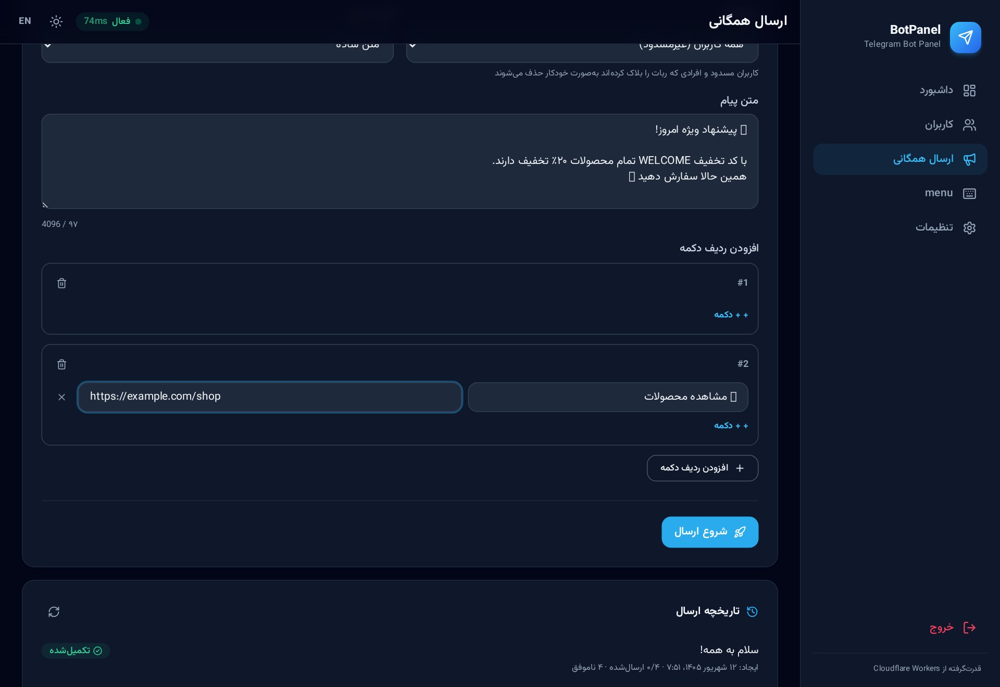
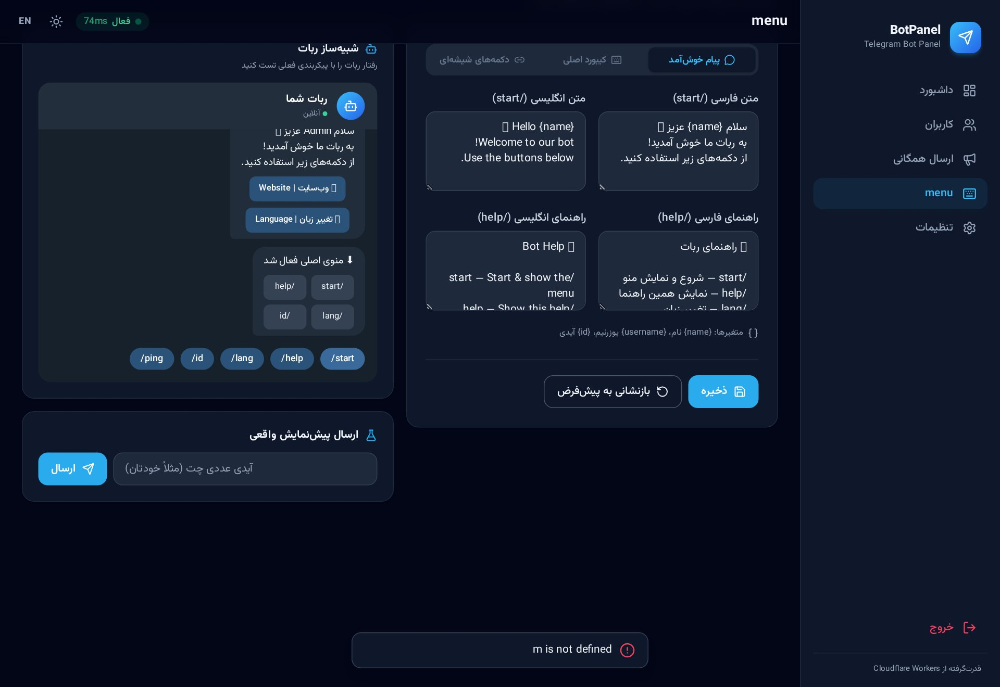

<div align="center">

# 🤖 BotPanel

**پنل مدیریت ربات تلگرام | Telegram Bot Admin Panel**

دو زبانه (فارسی/انگلیسی) · آماده پروداکشن · کاملاً Serverless
Bilingual (FA/EN) · Production-ready · Fully serverless


**فارسی** · [English ↓](#-english)


</div>

---

## 📸 گالری | Gallery

| | |
|---|---|
|  |  |
| **ورود امن · Secure login** | **حالت روشن + انگلیسی · Light mode + EN** |
|  |  |
| **مدیریت کاربران · Users** | **موتور ارسال همگانی · Broadcast** |
|  |  |
| **سازنده منو و شبیه‌ساز زنده · Menu builder + simulator** | **موبایل‌فرست · Mobile-first** |

---

<div dir="rtl" lang="fa">

## 📖 معرفی

پنل مدیریت وب **دو زبانه (فارسی/انگلیسی)** برای ربات تلگرام که **تماماً** روی زیرساخت Cloudflare اجرا می‌شود — بدون سرور، بدون دیتابیس خارجی و بدون هزینه در پلن رایگان برای شروع:

- **بک‌اند:** Cloudflare Workers (سینتکس ES Modules + فریمورک Hono)
- **پایگاه‌داده:** Cloudflare KV (نشست‌ها، تنظیمات، کاربران، ارسال همگانی)
- **فرانت‌اند:** اپ تک‌صفحه‌ای (SPA) با Tailwind CSS + آیکون‌های Lucide + فونت وزیرمتن
- **تلگرام:** وب‌هوک امن با هدر مخفی `secret_token` و پاسخ فوری ۲۰۰

## 🤖 درباره ربات (توضیح کامل)

این پروژه یک **ربات تلگرام آماده + پنل مدیریت کامل** است که با هم در یک Worker اجرا می‌شوند. ربات همین حالا کار می‌کند و همه رفتارش از داخل پنل قابل کنترل است — بدون دست زدن به کد.

### دستورات پیش‌فرض ربات

| دستور | کارکرد |
|---|---|
| `/start` | پیام خوش‌آمد (با متغیرهای `{name}`، `{username}`، `{id}`) + دکمه‌های شیشه‌ای + فعال‌سازی کیبورد اصلی |
| `/help` | نمایش متن راهنما (قابل ویرایش از پنل، جدا برای فا/EN) |
| `/lang` | تغییر زبان کاربر با دکمه شیشه‌ای — زبان هر کاربر جداگانه در KV ذخیره می‌شود |
| `/id` | نمایش آیدی عددی کاربر (برای ثبت در «ادمین‌های ربات») |
| `/ping` | بررسی فعال بودن ربات |

### جریان کار ربات

1. **ثبت خودکار کاربران:** اولین پیام هر کاربر → ذخیره نام، یوزرنیم، زمان عضویت، زبان و آخرین فعالیت در KV → نمایش فوری در پنل.
2. **دو زبانه واقعی:** هر کاربر با `/lang` زبان خود را انتخاب می‌کند و از آن به بعد پیام‌ها به همان زبان ارسال می‌شود؛ زبان پیش‌فرض از پنل قابل تغییر است.
3. **منوی کامل قابل ویرایش:** متن خوش‌آمد/راهنما، کیبورد اصلی و دکمه‌های شیشه‌ای (لینک یا کال‌بک) همگی از پنل ویرایش می‌شوند و **بدون دیپلوی مجدد** روی ربات اعمال می‌شوند.
4. **مسدودسازی:** کاربر مسدودشده به‌صورت کاملاً بی‌صدا نادیده گرفته می‌شود (نه جواب می‌گیرد و نه در ارسال همگانی حساب می‌شود) و دلیل مسدودی ثبت می‌شود.
5. **ارسال همگانی هوشمند:** با رعایت محدودیت نرخ تلگرام (~۲۵ پیام/ثانیه قابل تنظیم)، به‌صورت دسته‌ای ارسال می‌شود؛ پیشرفت زنده در پنل، امکان توقف/ادامه، و تشخیص خودکار افرادی که ربات را بلاک کرده‌اند (خطای 403 → علامت‌گذاری و حذف از ارسال‌های بعدی).
6. **پیام مستقیم:** ارسال پیام شخصی به هر کاربر از داخل پنل با فرمت HTML یا Markdown.

### امنیت ربات و پنل

- وب‌هوک فقط با هدر مخفی `X-Telegram-Bot-Api-Secret-Token` قبول می‌شود (جعل درخواست ناممکن است)
- پردازش آپدیت در `waitUntil` → پاسخ فوری ۲۰۰ به تلگرام (بدون ارسال مجدد آپدیت)
- رمز پنل در Wrangler Secrets؛ نشست‌ها فقط به‌صورت **هش SHA-256** در KV
- مقایسه رمز زمان-ثابت + قفل ضد بروت‌فورس (۵ تلاش / ۱۰ دقیقه / IP)
- توکن ربات در API همیشه ماسک‌شده برمی‌گردد

### توسعه دادن ربات

| چه می‌خواهید؟ | کجا؟ |
|---|---|
| تغییر متن‌های داخلی ربات | `src/telegram.js` → آبجکت `BOT_T` |
| افزودن دستور جدید | `src/telegram.js` → تابع `onMessage` (سوئیچ دستورات) |
| منطق دکمه‌های کال‌بک | `src/telegram.js` → انتهای `onCallback` |
| ظاهر پنل | `public/index.html` (رنگ برند در `tailwind.config`) |

> 📌 راهنمای عمیق و عیب‌یابی کامل: [`DEPLOY.fa.md`](DEPLOY.fa.md)

## ✨ امکانات پنل

| بخش | توضیح |
|---|---|
| 🔐 احراز هویت امن | رمز در Wrangler Secrets، مقایسه timing-safe، نشست ۷روزه، محدودیت نرخ ورود |
| 📊 داشبورد | آمار کلی، **نشانگر وضعیت لحظه‌ای ورکر** (تأخیر + مرکز داده + پینگ هر ۳۰ ثانیه)، وضعیت وب‌هوک تلگرام، کاربران اخیر |
| 👥 مدیریت کاربران | صفحه‌بندی cursor بومی KV، جستجو، مسدود/آزادسازی با دلیل، پیام مستقیم، جزئیات کامل |
| 📢 موتور ارسال همگانی | متن + HTML/MarkdownV2 + دکمه‌های URL، هدف‌گیری (همه/فعال ۷ روز/فعال ۳۰ روز)، Rate-Limit قابل تنظیم، پیشرفت زنده، توقف/ادامه |
| ⌨️ سازنده منو | ویرایش پیام‌ها (فا/EN)، کیبورد اصلی، دکمه‌های شیشه‌ای، **شبیه‌ساز زنده ربات** + ارسال پیش‌نمایش واقعی |
| ⚙️ تنظیمات | توکن ربات (ماسک‌شده)، ادمین‌ها، زبان پیش‌فرض، تنظیم/حذف وب‌هوک با یک کلیک، تیونینگ ارسال |
| 🌍 دو زبانه | سوئیچ کامل فا/EN با RTL/LTR، حالت تاریک/روشن، طراحی اول موبایل |

## 🏗️ معماری

```
تلگرام ──وب‌هوک──►  Cloudflare Worker (Hono)
                    ├─ POST /telegram/webhook   (هدر مخفی + waitUntil)
ادمین   ──HTTPS───► ├─ /api/*                  (Bearer session)
                    └─ /*  →  SPA (Assets)
                              │
                        Cloudflare KV
                 settings · menu · stats · user:{id}
                 session:{hash} · broadcast:{id}
                              │
                              ▼ Bot API (fetch)
                        api.telegram.org
```

**چرا ارسال همگانی «دسته‌ای» است؟** هر درخواست Worker به ~۵۰ subrequest محدود است؛ پنل هر بار یک دسته (پیش‌فرض ۲۵ پیام با فاصله ۴۰ms) می‌فرستد و جاب در KV ذخیره می‌شود → بدون سقف تعداد، قابل ازسرگیری، با پیشرفت زنده.

### ساختار پروژه

```
telegram-bot-panel/
├── wrangler.toml        # پیکربندی Worker + بایندینگ KV و Assets
├── .dev.vars.example    # نمونه محرمانه‌های توسعه لوکال
├── src/
│   ├── index.js         # ورودی: وب‌هوک / API / SPA
│   ├── kv.js            # لایه داده روی KV (طرح کلیدها + metadata)
│   ├── auth.js          # نشست‌ها، مقایسه timing-safe، Rate-limit
│   ├── telegram.js      # کلاینت Bot API + منطق ربات
│   └── routes/          # auth · dashboard · users · broadcast · menu · settings
├── public/index.html    # SPA کامل (Tailwind + Lucide + وزیرمتن)
├── assets/              # نشان‌های سازنده + اسکرین‌شات‌ها
├── scripts/smoke.mjs    # تست دود (۲۹ تست)
└── DEPLOY.fa.md         # 🚀 راهنمای کامل صفر تا صد
```

## 🚀 راه‌اندازی — دو روش

در هر دو روش ابتدا این **پیش‌نیاز مشترک** را انجام دهید:

> **📦 ساخت ربات:** در تلگرام به [@BotFather](https://t.me/BotFather) → `/newbot` → نام و یوزرنیم (با پسوند `bot`) بدهید → **توکن** (`123456:ABC...`) را کپی کنید.

### روش ۱: دستی از مرورگر (بدون ترمینال) 🖥️

اگر با ترمینال راحت نیستید، همه‌چیز از داخل مرورگر انجام می‌شود:

1. **ساخت پایگاه‌داده KV**
   وارد [dash.cloudflare.com](https://dash.cloudflare.com) شوید ← منوی چپ **Storage & Databases ← KV ← Create namespace** ← نام `botpanel-kv` بدهید ← **ID** ساخته‌شده را کپی کنید.

2. **ویرایش فایل کانفیگ در خود گیت‌هاب**
   در صفحه این مخزن روی فایل `wrangler.toml` کلیک کنید ← آیکون مداد ✏️ ← مقدار `REPLACE_WITH_YOUR_KV_NAMESPACE_ID` را با ID مرحله قبل جایگزین کنید ← **Commit changes**.

3. **اتصال مخزن به Cloudflare**
   داشبورد کلادفلر ← **Workers & Pages ← Create ← Workers/Projects** ← تب **Import a repository** ← **Connect to Git** ← گیت‌هاب را مجاز کنید ← مخزن `telegram-bot-panel` را انتخاب کنید ← **Begin setup** (تنظیمات پیش‌فرض درست است؛ Deploy command همان `npx wrangler deploy` است) ← **Save and Deploy**.
   ✅ از این به بعد هر commit/push روی مخزن، **خودکار دیپلوی** می‌شود (CI/CD داخلی کلادفلر).

4. **تنظیم رمزها در داشبورد**
   روی Worker ساخته‌شده کلیک کنید ← **Settings ← Variables and Secrets ← Add** ← سه متغیر از نوع **Secret** بسازید:
   | نام | مقدار |
   |---|---|
   | `ADMIN_PASSWORD` | رمز قوی ورود پنل |
   | `WEBHOOK_SECRET` | رشته تصادفی طولانی (مثلاً از [random.org](https://www.random.org/strings/) ۴۰ کاراکتر) |
   | `BOT_TOKEN` | توکن BotFather (اختیاری — از پنل هم می‌شود) |
   سپس **Deployments ← … ← Redeploy** تا رازها اعمال شوند.

5. **اتصال ربات**
   آدرس `https://<نام-ورکر>.<ساب‌دامنه>.workers.dev` را باز کنید ← وارد شوید ← **تنظیمات ← «تنظیم وب‌هوک»** ← در تلگرام `/start` بفرستید. 🎉

### روش ۲: با ترمینال (CLI) ⌨️

پیش‌نیاز: Node.js ≥ 18

```bash
git clone https://github.com/developerAmira/telegram-bot-panel.git
cd telegram-bot-panel
npm install

npx wrangler login                                  # ۱) ورود به کلادفلر (مرورگر باز می‌شود)
npx wrangler kv namespace create BOT_KV             # ۲) ساخت KV → id خروجی را در wrangler.toml بگذارید
npx wrangler secret put ADMIN_PASSWORD              # ۳) رمز ورود پنل
npx wrangler secret put WEBHOOK_SECRET              #    راز وب‌هوک (openssl rand -hex 32)
npx wrangler secret put BOT_TOKEN                   #    توکن BotFather (اختیاری)
npm run deploy                                      # ۴) دیپلوی 🚀
```

سپس در پنل وارد شوید ← **تنظیمات ← «تنظیم وب‌هوک»** ← در تلگرام `/start` بفرستید — و با `/id` آیدی خود را در «ادمین‌های ربات» ذخیره کنید. تمام!

## 🖥️ توسعه لوکال

```bash
cp .dev.vars.example .dev.vars    # رمز لوکال: change-me-dev
npm run dev                       # → http://localhost:8787
npm run smoke                     # ۲۹ تست خودکار
```

## 🔌 API (خلاصه)

همه پاسخ‌ها `{ok,data}` / `{ok,error}` با احراز هویت `Authorization: Bearer <token>`:

`POST /api/auth/login` · `GET /api/dashboard/stats` · `GET /api/users?cursor&limit&q` · `POST /api/users/:id/ban|unban|message` · `POST /api/broadcast` + `/:id/tick|pause|resume|stop` · `GET/PUT /api/menu` · `POST /api/menu/preview` · `GET/PUT /api/settings` · `POST /api/settings/webhook` · `GET /api/health` · `POST /telegram/webhook`

## ⚠️ نکات مقیاس‌پذیری

شمارنده‌های KV «تقریبی»اند (افزایش اتمیک ندارد ← برای آمار دقیق: D1) · برای ارسال همگانی ده‌ها هزارتایی: Cloudflare Queues یا Durable Objects (ساختار job/cursor همین الان سازگار است) · لاگ زنده: `npx wrangler tail`

</div>

---

## 🇬🇧 English

<div dir="ltr" lang="en">

## 📖 About

A **bilingual (Persian/English)**, production-ready admin panel for a Telegram bot, hosted **entirely** on Cloudflare's serverless infrastructure — no servers, no external database, free-tier friendly:

- **Backend:** Cloudflare Workers (ES Modules syntax + Hono framework)
- **Database:** Cloudflare KV (sessions, settings, users, broadcasts)
- **Frontend:** Single-page app with Tailwind CSS + Lucide icons + Vazirmatn font
- **Telegram:** secure webhook via the `secret_token` header, instant 200 responses

## 🤖 About the bot (full description)

This project ships a **working Telegram bot + full admin panel** running together in a single Worker. The bot works out of the box and every part of its behavior is controllable from the panel — no code changes needed.

### Default bot commands

| Command | What it does |
|---|---|
| `/start` | Welcome message (supports `{name}`, `{username}`, `{id}` variables) + inline buttons + main keyboard |
| `/help` | Help text (editable from the panel, separate FA/EN versions) |
| `/lang` | Per-user language switch — each user's language is stored individually in KV |
| `/id` | Shows the user's numeric ID (to register as a bot admin) |
| `/ping` | Liveness check |

### How the bot works

1. **Automatic user tracking:** a user's first message stores their name, username, join date, language and last activity in KV — they instantly appear in the panel.
2. **Truly bilingual:** each user picks their language via `/lang`; every message afterwards respects it. Default language is configurable from the panel.
3. **Fully editable menu:** welcome/help texts, main keyboard and inline buttons (URL or callback) are all edited from the panel and go live **without redeploying**.
4. **Banning:** banned users are silently ignored (no replies, excluded from broadcasts) with the ban reason recorded.
5. **Smart broadcasts:** rate-limited (~25 msg/s, tunable) batch sending with live progress, pause/resume, and automatic detection of users who blocked the bot (403 → flagged and skipped afterwards).
6. **Direct messages:** send an HTML/Markdown message to any individual user from the panel.

### Security

Webhook accepted only with the secret `X-Telegram-Bot-Api-Secret-Token` header · updates processed in `waitUntil` with instant 200s · panel password in Wrangler Secrets · sessions stored as SHA-256 hashes only · timing-safe password comparison + brute-force lockout (5 tries / 10 min / IP) · bot token always masked in API responses.

### Extending the bot

| Want to… | Where |
|---|---|
| Change built-in bot texts | `src/telegram.js` → `BOT_T` |
| Add a new command | `src/telegram.js` → `onMessage` switch |
| Custom callback logic | `src/telegram.js` → end of `onCallback` |
| Restyle the panel | `public/index.html` (brand color in `tailwind.config`) |

## ✨ Panel features

| Area | Details |
|---|---|
| 🔐 Secure auth | Secrets-only password, timing-safe compare, 7-day sessions, login rate-limiting |
| 📊 Dashboard | Stats, **live worker status** (latency + data center + 30s pings), Telegram webhook health, recent users |
| 👥 User management | KV-native cursor pagination, search, ban/unban, direct messages, full details |
| 📢 Broadcast engine | Text + HTML/MarkdownV2 + URL buttons, targeting (all / active 7d / 30d), tunable rate limiting, live progress |
| ⌨️ Menu builder | Texts (FA/EN), main keyboard, inline buttons, **live bot simulator** + real preview |
| ⚙️ Settings | Bot token (masked), admin IDs, default language, one-click webhook management |
| 🌍 Bilingual | Full FA/EN with RTL/LTR, dark/light, mobile-first |

## 🚀 Setup — two methods

Shared prerequisite for both:

> **📦 Create the bot:** on Telegram, talk to [@BotFather](https://t.me/BotFather) → `/newbot` → choose a name and a `bot`-suffixed username → copy the **token** (`123456:ABC...`).

### Method 1: Manual, browser-only (no terminal) 🖥️

1. **Create the KV database** — [dash.cloudflare.com](https://dash.cloudflare.com) → **Storage & Databases → KV → Create namespace** → name it `botpanel-kv` → copy the generated **ID**.
2. **Edit the config on GitHub** — open `wrangler.toml` in this repo → click the pencil ✏️ → replace `REPLACE_WITH_YOUR_KV_NAMESPACE_ID` with your ID → **Commit changes**.
3. **Connect the repo to Cloudflare** — dashboard → **Workers & Pages → Create → Workers/Projects** → **Import a repository** tab → **Connect to Git** → authorize GitHub → pick `telegram-bot-panel` → **Begin setup** (defaults are fine; deploy command is `npx wrangler deploy`) → **Save and Deploy**.
   ✅ From now on, every git push **auto-deploys** (built-in Cloudflare CI/CD).
4. **Add secrets in the dashboard** — open the Worker → **Settings → Variables and Secrets → Add** (type **Secret**): `ADMIN_PASSWORD` (strong panel password), `WEBHOOK_SECRET` (long random string), `BOT_TOKEN` (optional). Then **Deployments → … → Redeploy**.
5. **Connect the bot** — open `https://<worker>.<subdomain>.workers.dev` → log in → **Settings → “Set webhook”** → send `/start` to your bot on Telegram. 🎉

### Method 2: Terminal (CLI) ⌨️

Prerequisite: Node.js ≥ 18

```bash
git clone https://github.com/developerAmira/telegram-bot-panel.git
cd telegram-bot-panel
npm install

npx wrangler login                                  # 1) sign in to Cloudflare
npx wrangler kv namespace create BOT_KV             # 2) create KV → put id in wrangler.toml
npx wrangler secret put ADMIN_PASSWORD              # 3) panel password
npx wrangler secret put WEBHOOK_SECRET              #    webhook secret (openssl rand -hex 32)
npx wrangler secret put BOT_TOKEN                   #    BotFather token (optional)
npm run deploy                                      # 4) deploy 🚀
```

Then open the panel → log in → **Settings → “Set webhook”** → send `/start` to the bot — grab your ID with `/id` and save it under “Bot admin IDs”. Done!

## 🖥️ Local development

```bash
cp .dev.vars.example .dev.vars    # local password: change-me-dev
npm run dev                       # → http://localhost:8787
npm run smoke                     # 29 automated tests
```

## 🔌 API (summary)

`POST /api/auth/login` · `GET /api/dashboard/stats` · `GET /api/users?cursor&limit&q` · `POST /api/users/:id/ban|unban|message` · `POST /api/broadcast` + `/:id/tick|pause|resume|stop` · `GET/PUT /api/menu` · `POST /api/menu/preview` · `GET/PUT /api/settings` · `POST /api/settings/webhook` · `GET /api/health` · `POST /telegram/webhook`

## ⚠️ Scaling notes

KV counters are approximate (no atomic increments → use D1 for exact stats) · for very large broadcasts, move the tick engine to Cloudflare Queues or Durable Objects (the job/cursor structure is already compatible) · live logs: `npx wrangler tail`

</div>

---

<div align="center">

## 📮 سازنده | Creator

[](https://t.me/developer_as)

[](https://instagram.com/x.amirrezaa1)

**تلگرام | Telegram:** [@developer_as](https://t.me/developer_as) · **اینستاگرام | Instagram:** [@x.amirrezaa1](https://instagram.com/x.amirrezaa1)

ساخته‌شده با ❤️ روی Cloudflare Workers · Made with ❤️ on Cloudflare Workers

</div>
